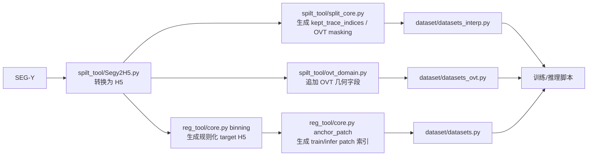

# Seismic Data Pipeline Notes

这个仓库目前最核心的三部分是：

- `spilt_tool/`：SEG-Y/H5 预处理、观测系统降采样、OVT 域 masking 与 split 产物生成
- `reg_tool/`：规则化目标生成、anchor/query-context patch 预计算、几何评估与可视化
- `dataset/`：PyTorch `Dataset` 封装，负责把 H5 和预计算索引喂给训练/推理脚本

从代码结构看，这套代码主要服务于地震规则化 / 插值 / 重建实验。三个目录不是孤立的，而是一条连续的数据链路。

说明：

- 目录名 `spilt_tool/` 沿用当前仓库命名，虽然看起来像 `split_tool` 的拼写误差，但 README 中保持与代码一致。
- 仓库里很多脚本仍保留本地/NAS 绝对路径，上传 GitHub 前需要先改成你自己的路径配置。

## Overall Flow



## Data Convention

大多数脚本都围绕一个 H5 group 工作，并默认寻找“第一个含有 `data` 数据集的 group”。

常见基础字段：

- `data`: `[N_trace, T]` 地震道数据
- `sx`, `sy`, `rx`, `ry`: 炮点 / 检波点坐标
- `shot_line`, `shot_stake`, `recv_line`, `recv_stake`, `trace_idx`: 规则化和匹配时常用的几何键
- `mask`: 规则网格上是否已有观测道，`reg_tool/core.py` 和部分推理流程会使用

OVT 相关字段：

- 连续量：`mx`, `my`, `hx`, `hy`, `offset_mag`, `azimuth`
- 离散格点：`imx`, `imy`, `ihx`, `ihy`
- 辅助字段：`mx_center`, `my_center`, `hx_center`, `hy_center`, `fold`

## 1. `spilt_tool/`

这一层负责“把原始数据变成可训练/可实验的输入索引”。它既支持传统的检波点域降采样，也支持 OVT 域 masking。

### 关键脚本

| 脚本 | 作用 | 主要输出 |
| --- | --- | --- |
| `spilt_tool/Segy2H5.py` | 读取 SEG-Y 道头与 trace，按几何排序后写入 H5 | H5 文件，包含 `data/sx/sy/rx/ry/...` |
| `spilt_tool/split_core.py` | 统一入口。支持检波点域采样 `sample`，也支持 OVT 域 masking `ovt_sample` | `kept_trace_indices_*.npy`、mask 统计、表格、预览图 |
| `spilt_tool/ovt_domain.py` | 从 SEG-Y 或已有 H5 计算 OVT 几何字段，并可导出 trace 级表与 OVT gather | H5 新字段、CSV/Parquet、OVT gather、可视化 |
| `spilt_tool/ovt_masking.py` | 构建 OVT support index，并在 OVT cell 上执行多种 masking 策略 | kept/masked trace 索引、mask table、stats JSON、preview PNG |
| `spilt_tool/split_tool.py` | 从 split 目录中解析 `train/val/test` JSON 及其配置文件 | 供上层脚本复用的 split 元数据 |
| `spilt_tool/run.sh` | 最简单的示例脚本 | 演示命令 |

### `split_core.py` 支持的两条主线

#### A. 检波点域降采样

命令形式：

```bash
python spilt_tool/split_core.py sample <keep_ratio> <mode> [key]
```

支持模式：

- `irregular`：保留一部分检波点并做扰动
- `jitter`：近似网格抖动采样
- `random`：随机独立保留
- `line_recv`：整条检波线缺失
- `line_shot`：整条炮线缺失
- `mixed`：混合策略

核心产物：

- `kept_trace_indices_<mode>_<keep_ratio>.npy`
- `kept_receiver_<mode>_<keep_ratio>.png`
- 单炮示意图 `..._one_shot.png`

这个 `kept_trace_indices_*.npy` 会被 `dataset/datasets_interp.py` 当作 `train_idx_np` 直接读取。

#### B. OVT 域 masking

命令形式：

```bash
python spilt_tool/split_core.py ovt_sample --mode random_bin --mask_mode eval ...
```

支持的 OVT masking 策略：

- `random_bin`
- `azimuth_sector`
- `offset_truncation`
- `midpoint_block`

`ovt_masking.py` 会先把 trace 聚合到 OVT support，再在 support 上做 drop/keep，最后回写到 trace 级索引。`train` 模式还支持 mixture 采样，用于在线训练时随机混合多种 mask 机制。

### `ovt_domain.py` 的角色

如果你已经有 H5，只想补齐 OVT 几何字段，可以直接：

```bash
python spilt_tool/ovt_domain.py --h5 your_data.h5 --h5_group 1551
```

它会把以下字段追加到 H5：

- `mx`, `my`, `hx`, `hy`
- `imx`, `imy`, `ihx`, `ihy`
- `mx_center`, `my_center`, `hx_center`, `hy_center`
- `fold`

这一步对 `dataset/datasets_ovt.py` 很重要，因为该数据集会基于 patch 内 OVT 几何在线构造 mask。

## 2. `reg_tool/`

这一层负责“把规则化任务需要的几何关系预计算出来”。重点不是直接读数据训练，而是生成训练池、推理 patch、规则化 target，以及用于诊断几何质量的评估结果。

### 关键脚本

| 脚本 | 作用 | 主要输出 |
| --- | --- | --- |
| `reg_tool/core.py` | 总入口，支持 `anchor_patch` / `binning` / `kdtree` / `csg` / `crg` | patch 索引、规则化 target、gather 索引 |
| `reg_tool/patch_sampler.py` | patch 构造核心库，负责 train pool / infer patch / 2D&4D 预计算 / 重叠结果融合 | 内存中的 patch dict 或预计算数组 |
| `reg_tool/anchor_selector.py` | 坐标域 anchor 选取：FPS、facility location、value-based | `anchor_idx` |
| `reg_tool/eval_patch.py` | 对 anchor/patch 做几何质量评估 | coverage、redundancy、patch radius/diversity/overlap |
| `reg_tool/visualize_anchor_patches.py` | 大规模 anchor/patch 2D 可视化 | overview PNG |
| `reg_tool/Segy2H5.py` | 更偏规则化流程的 SEG-Y → H5 工具 | H5 |

### `core.py` 的常用模式

#### A. `binning`

作用：

- 按 `(shot_line, shot_stake, recv_line, recv_stake)` 四维键，把 irregular raw 数据对齐到规则网格
- 如果同一个规则键对应多条 raw trace，会先做平均
- 输出规则化 target 和 `mask`

适合场景：

- 构造训练或评估用的规则网格 target H5

#### B. `anchor_patch`

作用：

- 先对观测点做归一化
- 选择 anchor
- 为训练阶段生成 anchor-centered observed pool
- 为推理阶段生成 block/query/context 关系

`core.py` 默认会在 `patch_dir` 落下这批关键文件：

- `coord_norm_stats.npz`
- `anchor_train_patch_idx_2d.npz`
- `anchor_train_context_idx_2d.npz`
- `anchor_train_query_idx_2d.npz`
- `anchor_train_anchor_idx.npy`
- `anchor_train_anchor_coord.npy`
- `infer_patch_idx_2d.npz`
- `infer_patch_mask_2d.npz`
- `infer_block_id.npy`
- `infer_block_center_grid_idx.npy`

这些产物会被 `dataset/datasets.py` 或推理脚本继续消费。

#### C. `csg` / `crg`

作用：

- `csg`：按共炮点道集组织 trace 索引
- `crg`：按共检波点道集组织 trace 索引

更偏传统 gather 级调试、可视化或旧流程兼容。

### `patch_sampler.py` 里最关键的语义

它把训练和推理分成两种不同的“索引组织方式”：

- 训练：先为每个 anchor 预计算一个 observed pool，再在线从 pool 中抽 query/context
- 推理：先为规则网格 block 生成 query 集合，再为 query 找 context

常见产物语义：

- `pool_idx_2d`：训练阶段的候选观测池
- `grid_query_idx_list`：推理时某个 patch 对应的规则网格 query
- `context_idx_list`：推理时为该 query 集合挑出的观测 context
- `anchor_grid_idx_list`：推理时用于代表某个 query chunk 的锚点

### `eval_patch.py`

这个脚本不依赖训练模型，只看几何结构，适合快速判断 patch 设计是否合理。输出的 Level-1 指标包括：

- coverage：锚点对观测空间的覆盖能力
- redundancy：锚点之间是否过密
- patch radius：patch 半径
- patch diversity：patch 内多样性
- patch overlap：patch 间重叠程度

## 3. `dataset/`

这一层负责把 H5 数据和前面两层生成的索引包装成训练/推理可直接使用的 `torch.utils.data.Dataset`。

### 关键脚本

| 脚本 | 作用 | 主要输入 |
| --- | --- | --- |
| `dataset/datasets.py` | query-context 和 legacy patch 数据集 | H5 + `reg_tool` 生成的 patch 索引 |
| `dataset/datasets_interp.py` | 插值任务数据集 | irregular H5 + `kept_trace_indices_*.npy` |
| `dataset/datasets_ovt.py` | OVT 在线 masking 版本的数据集 | 含 OVT 字段的 H5 |
| `dataset/config.py` | 默认参数与路径 | 本地路径配置 |

### `datasets.py`

包含两个主要类：

- `DatasetH5_all_queryctx`
  - 面向 query-context 形式的数据
  - 能识别多种 `dataset_neighbors` 格式：
    - legacy `["0"]`
    - 训练池 `pool_idx_2d`
    - 推理 `grid_query_idx_list + context_idx_list`
  - 训练时会把 query 道置零，context 保留，输出 `is_query/query_count/context_count`

- `DatasetH5_all`
  - 更偏旧版兼容
  - 使用 legacy 邻域数组直接构造 patch

### `datasets_interp.py`

核心类是 `DatasetH5_interp`，对应更传统的插值训练/测试流程：

- 训练：
  - 读取 irregular H5
  - 从 `kept_trace_indices_*.npy` 中拿到可用 trace
  - 在已保留的 trace 里再做一次 self-supervised random missing
- 测试：
  - 使用规则网格 H5
  - 按 `survey_line_key`（默认 `recv_line`）逐测线组织输入

这条链路直接对应 `spilt_tool/split_core.py sample ...` 的输出。

### `datasets_ovt.py`

核心类是 `DatasetH5_ovt_interp`，它继承自 `DatasetH5_interp`，但训练时不再只是随机缺失，而是：

- 先对 patch 内 trace 按 OVT 单元排序
- 再调用 `ovt_masking.dispatch_ovt_mask(...)`
- 在线生成 OVT 结构感知的 keep/drop mask

如果 H5 中没有 OVT 几何字段，这个流程就无法完整工作，因此通常要先经过 `spilt_tool/ovt_domain.py`。

## Common Workflows

### 1. 做传统插值训练

1. 用 `spilt_tool/Segy2H5.py` 把 SEG-Y 转成 H5
2. 用 `spilt_tool/split_core.py sample ...` 生成 `kept_trace_indices_*.npy`
3. 用 `dataset/datasets_interp.py` 或上层训练脚本读取 irregular H5 和索引

示例：

```bash
python spilt_tool/Segy2H5.py
python spilt_tool/split_core.py sample 0.5 random
```

### 2. 做 OVT 感知的 masking 实验

1. 用 `spilt_tool/ovt_domain.py` 给 H5 追加 OVT 字段
2. 选择：
   - 离线生成 mask：`spilt_tool/split_core.py ovt_sample ...`
   - 在线生成 mask：`dataset/datasets_ovt.py`

示例：

```bash
python spilt_tool/ovt_domain.py --h5 your_data.h5 --h5_group 1551
python spilt_tool/split_core.py ovt_sample --mode random_bin --mask_mode eval --h5_path your_data.h5
```

### 3. 做规则化 / query-context patch 推理

1. 准备 irregular H5 和 regular H5
2. 先用 `reg_tool/core.py binning` 构造规则化 target（如果需要）
3. 用 `reg_tool/core.py anchor_patch` 生成 train/infer patch 索引
4. 用 `dataset/datasets.py` 加载这些索引给训练或推理脚本使用

## Dependencies

从源码 import 看，至少需要这些常见依赖：

- `numpy`
- `scipy`
- `pandas`
- `h5py`
- `segyio`
- `torch`
- `tqdm`
- `matplotlib`

部分脚本会尝试使用 GPU 或 Accelerate/MPS，但这些不是每个脚本的硬依赖。

## Upload To GitHub: Suggested Cleanup

上传前建议先整理下面几项：

- 把 `dataset/config.py`、`reg_tool/config.py`、`spilt_tool/dataset_config.py`、`reg_tool/dataset_config.py` 里的绝对路径改成可配置路径
- 清理 `__pycache__/`、临时图片、实验输出文件
- 增加 `.gitignore`
- 检查旧的 `generate_py` 路径引用是否要统一到当前目录结构
- 如果后续准备长期维护，建议考虑是否把 `spilt_tool/` 重命名为 `split_tool/`，但这会涉及 import 和脚本路径联动修改

## Current Limitations

- 配置文件里仍有较多硬编码路径
- 不同目录里存在功能相近的 `Segy2H5.py`，定位略有重叠
- 部分脚本仍引用旧模块路径 `generate_py.*`，和当前仓库目录名不完全一致
- `dataset/` 与 `finetune/dataset/` 有重复代码，需要后续再统一
- 目前还没有统一的环境安装说明或 `requirements.txt`

---

如果把这三个目录单独看，可以把它们理解为：

- `spilt_tool/`：生成“观测缺失方式”和 OVT 几何
- `reg_tool/`：生成“训练/推理需要的 patch 组织方式”
- `dataset/`：把前两者的产物变成真正能送进模型的数据样本
